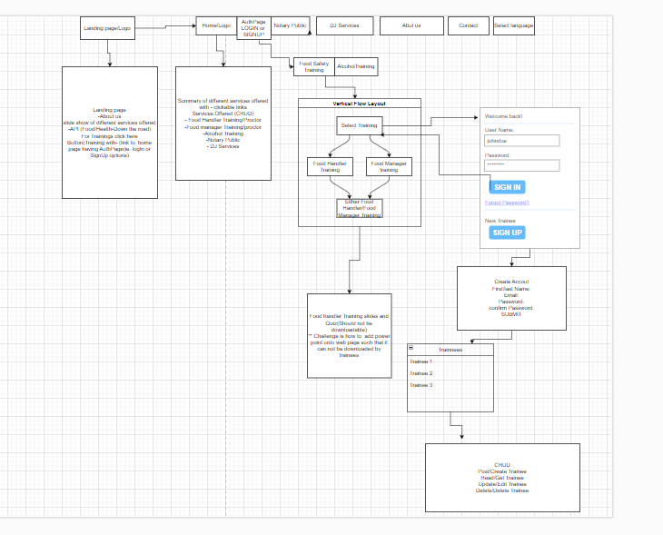

# Introduction:

> End point of SAGS project is to create a multi-service app that provides services and trainings to the general public in different sectors.

- Wireframe done with draw.io
Link: https://app.diagrams.net/

# Technologies used:

*Technologies*

- MongoDB -document database
- Express(.js) -Node.js web framework
- Read(.js) - a client-side JavaScript framework
- Node(.js) - the premier JavaScript web server
- React-slideshow-image
- howler

*Libraries*
- React - a javascript library for building web apps. It is one of the most popular front=end frameworks
- axios - a react library used to send asynchronous HTTP requests to REST endpoints. Very useful to perform CRUD operations.
- MERN-Stack Infrastructure

*API*
- Created Schama via MongoDB

# Getting Started: 

- Project planning done on Trello board:
*Link: https://trello.com/b/021wCbIm/mod-3-project-a-mern-stack-application*

- Deployed on vercel and render:

*Vercel.app Link:https://sags-app-final-7fxi3m7ny-likowo.vercel.app/*

*Render.com Link: https://sags-app-final.onrender.com*

# Unsolved problems:

- CORB stopping audio from playing with error; ***Cross-Origin Read Blocking (CORB) blocked cross-origin response***
- Slide show stopped after resizing with error;  ***ResizeObserver loop completed with undelivered notifications***
- Could not trace how a red border was applied to my welcome  and 
- Deployed app on vercel.app but updates not registered. Got alert in console. ***  Due to `builds` existing in your configuration file, the Build and Development Settings defined in your Project Settings will not apply. Learn More: https://vercel.link/unused-build-settings ***

# Future Enhancements:

- Getting audio to play. This will improve UI experience
- Redo slide size so slide show can render. This will improve UI experience
- Work on having boolean option show up for added services
- Complete building pages for all current services being offered and make web app available to the public

# MERN-Stack Infrastructure

Clone this repo to provide the starter code for a comprehensive MERN-Stack project including token-based authentication.